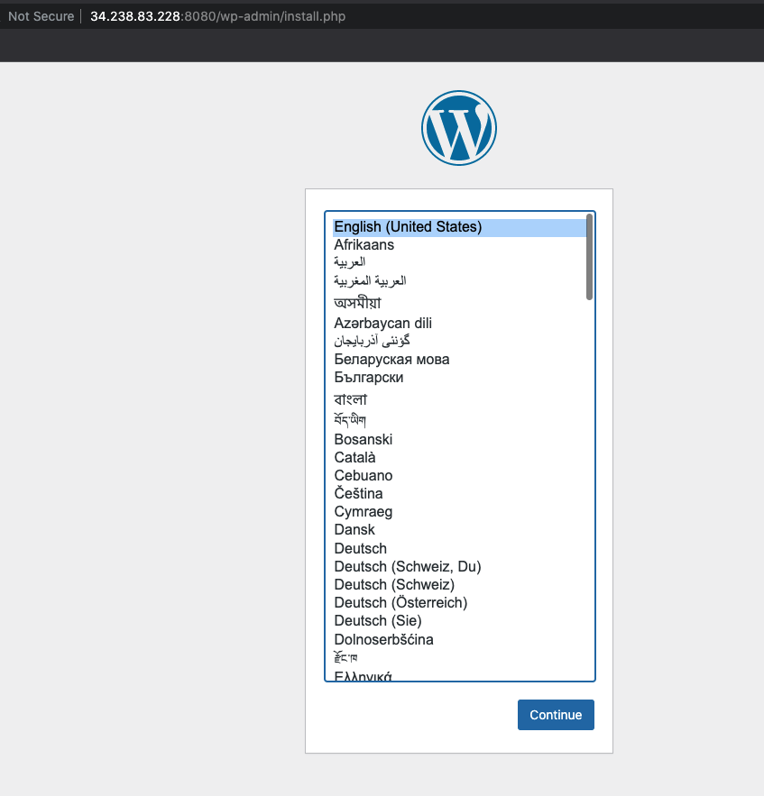
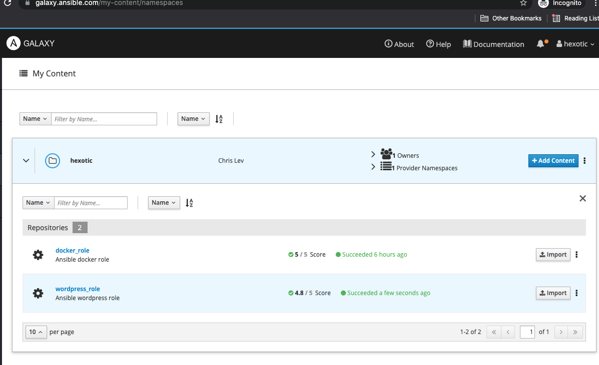
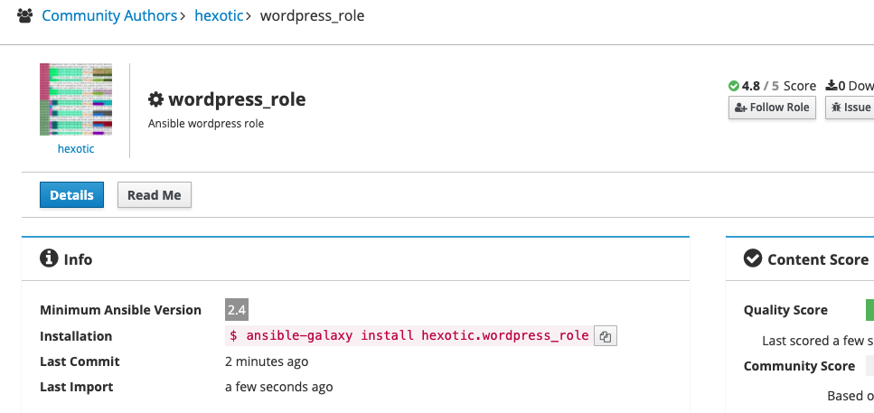
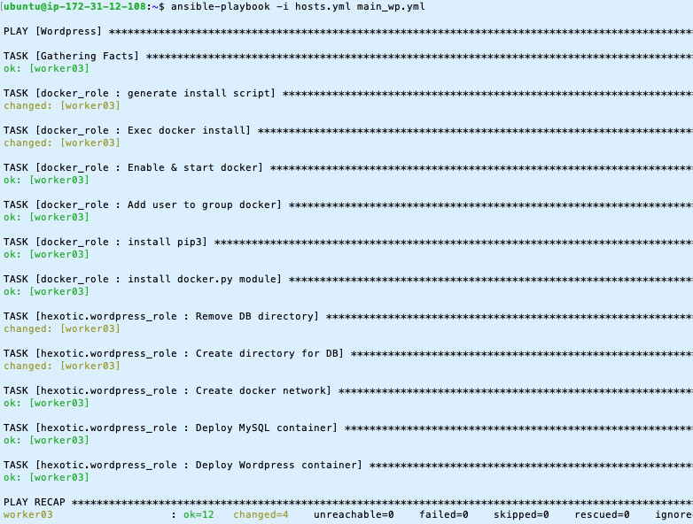

# Wordpress Role Ansible Miniproject
The aim is to lauch Wordpress using containers with an Ansible role and with as many as parameters possible.

# Role writing
We need the followings tasks:
* creation of 2 containers: one for mysql and one for wordpress
* creation of a directory that will be mounted as a volume in the mysql container.

## Tasks

This translates to:<br>
`tasks/main.yml`
```yaml
# Tasks for the role
- name: "Remove DB directory"
  file:
    path: "{{ mysql_dir }}"
    state: absent

- name: "Create directory for DB"
  file:
    path: "{{  mysql_dir }}"
    state: directory

- name: "Create docker network"
  docker_network:
    name: "{{ wp_network }}"

- name: "Deploy MySQL container"
  docker_container:
   name: "{{ mysql_container_name }}"
   image: mysql
   env:
     MYSQL_ROOT_PASSWORD: "{{ mysql_root_password }}"
     MYSQL_DATABASE: "{{ mysql_database }}"
     MYSQL_USER: "{{ mysql_user }}"
     MYSQL_PASSWORD: "{{ mysql_password }}"
   networks:
     - name: "{{ wp_network }}"
   volumes:
     - "{{ mysql_dir }}:/var/lib/mysql"


# Deploy Wordpress container
- name: "Deploy Wordpress container"
  docker_container:
    name: "{{ wordpress_container_name }}"
    image: wordpress
    ports:
      - "{{ wordpress_port }}:80"
    networks:
      - name: "{{ wp_network }}"
    env:
      WORDPRESS_DB_HOST: "{{ mysql_container_name }}"
      WORDPRESS_DB_USER: "{{ mysql_user }}"
      WORDPRESS_DB_PASSWORD: "{{ mysql_password }}"
      WORDPRESS_DB_NAME: "{{ mysql_database }}"

```

## Variables

With the following variables:
<br>
`defaults/main.yml`
```yaml
# Docker network name
wp_network: wordpress

mysql_container_name: wp_db
wordpress_container_name: wordpress

mysql_root_password: password
mysql_database: wp_db
mysql_user: chris
mysql_password: chris
mysql_dir: /wordpress/db

# Exposed port
wordpress_port: 8080
```

The role has the following structure:
```sh
wordpress_role
├── README.md
├── defaults
│   └── main.yml
├── meta
│   └── main.yml
├── tasks
│   └── main.yml
├── templates
└── tests
    ├── inventory
    └── main.yml
```

## Playbook for testing:
`main_wp.yml`
```yaml
---
- name: "Wordpress"
  become: yes
  hosts: worker03
  vars_files:
    - /home/ubuntu/secrets.yml

  roles:
    - wordpress_role
```

`hosts.yml` (excerpt)
```yaml
all:
  children:
    prod:
        worker03:
          ansible_user: ubuntu
          ansible_host: 172.31.90.221
          hostname: AnsibleWorker03
```

Command to run:
```sh
ansible-playbook -i hosts.yml main_wp.yml
```

## Result


# Putting role in Ansible Galaxy

First we checkin the files in github: 
https://github.com/hexotic/wordpress_role

Then we need to import repo in ansible galaxy:
* Click add **content**
* Then click **import**



And this results in:<br>
https://galaxy.ansible.com/hexotic/wordpress_role



# Consuming the role

We copy the installation line and execute it on the Ansible master:<br>
`ansible-galaxy install hexotic.wordpress_role`

This gives the following output:
```sh
$ ansible-galaxy install hexotic.wordpress_role
Starting galaxy role install process
- downloading role 'wordpress_role', owned by hexotic
- downloading role from https://github.com/hexotic/wordpress_role/archive/main.tar.gz
- extracting hexotic.wordpress_role to /home/ubuntu/.ansible/roles/hexotic.wordpress_role
- hexotic.wordpress_role (main) was installed successfully
```

The playbook is now:
```yaml
---
- name: "Wordpress"
  become: yes
  hosts: worker03
  vars_files:
    - /home/ubuntu/secrets.yml

  roles:
    - hexotic.docker_role
    - hexotic.wordpress_role
```

Command to run:
```sh
ansible-playbook -i hosts.yml main_wp.yml
```

Output:


# Conclusion

Mini project files:

* [github role repo](https://github.com/hexotic/wordpress_role)
* [ansible galaxy](https://galaxy.ansible.com/hexotic/wordpress_role)