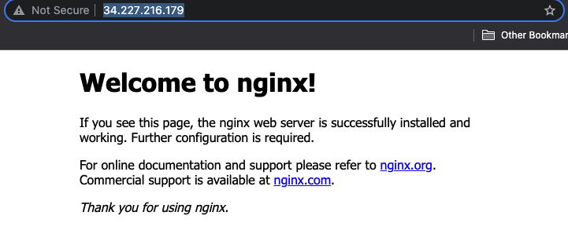

# Terraform miniproject
The goal is to uses modules for deploying an EC2 instance with a public IP address, a security group and an additional EBS volume.

<br>
There are 4 modules:

* ec2: for creating an EC2
* ebs: for creating an EBS
* eip: for creating an EIP
* sg: for creating a security group

All the modules must use variables in order to be able to customise created resources.

## Module structure
```
module_name
├── module_name.tf
├── outputs.tf
└── variables.tf
```

* `module_name.tf` : contains the code to instantiate a resource.
* `outputs.tf` : contains the **output data** required to use the resource created by the module.
* `variables.tf`: contains variables that will be overriden by the calling code.

## Common variables
I choose to create the following variables in all the modules:
* `admin`: contains the name of the creator
* `env` : contains the variable defining the environnement : like `dev`, `prod`

## Provider.tf
I use this provider file along environment variables to export AWS credentials.

```sh
export AWS_ACCESS_KEY_ID="XXXX"
export AWS_SECRET_ACCESS_KEY="XXXX"
```

```
provider "aws" {
  region = "us-east-1"
}
```

# Module EC2

## Code
`ec2.tf`
```ruby
resource "aws_instance" "ec2-mod" {
  tags = {
    Name = "${var.admin}-ec2-${var.env}",
    iac  = "terraform"
  }
  key_name      = var.key_name
  ami           = data.aws_ami.myami.id
  instance_type = var.instance_type

  vpc_security_group_ids = [var.sg_id]
}

data "aws_ami" "myami" {
  most_recent = true
  owners      = ["099720109477"]
  filter {
    name   = "name"
    values = ["ubuntu/images/hvm-ssd/ubuntu-bionic*"]
  }
}
```

`outputs.tf`
```ruby
output "ec2_id" {
  value = aws_instance.ec2-mod.id
}

output "ec2_ami" {
  value = aws_instance.ec2-mod.ami
}

output "ec2_az" {
  value = aws_instance.ec2-mod.availability_zone
}
```

`variables.tf`
```variable "admin" {
  default = ""
  type    = string
}

variable "env" {
  default = ""
  type    = string
}

variable "ami" {
  default = "ami-04505e74c0741db8d"
}

variable "instance_type" {
  default = "t2.micro"
}

variable "key_name" {
  default = ""
  type = string
}

variable "sg_id" {
  default = ""
  type = string
}
```

# Module EBS
`ebs.tf`

```ruby
resource "aws_ebs_volume" "ebs-mod" {
  size = var.size
  availability_zone = "${var.az}"

  tags = {
    Name = "${var.admin}-ebs-${var.env}"
  }
}
```

`outputs.tf`
```ruby
output "ebs_id" {
  value = aws_ebs_volume.ebs-mod.id
}
```

`variables`

```
variable "admin" {
  default = ""
  type    = string
}

variable "env" {
  default = ""
  type    = string
}

variable "az" {
  default = ""
  type    = string
}

variable "size" {
  default = 10 # GiB
  type    = number
}
```

# Module EIP
`eip.tf`
```ruby
resource "aws_eip" "eip-mod" {
  vpc = true

  tags = {
    Name = "${var.admin}-eip-${var.env}"
  }
}
```

`outputs.tf`

```
output "eip_ip" {
  value = aws_eip.eip-mod.public_ip
}

output "eip_id" {
  value = aws_eip.eip-mod.id
}
```

`variables`

```ruby
variable "admin" {
  default = ""
  type    = string
}

variable "env" {
  default = ""
  type    = string
}
```

# Module SG
Note: I had to add port 22 for ssh, for remote provisionning.

`sg.tf`

```ruby
resource "aws_security_group" "sg-mod" {

  description = "Allow SSH HTTP and TLS"

  ingress {
    description      = "HTTP"
    from_port        = 80
    to_port          = 80
    protocol         = "tcp"
    cidr_blocks      = ["0.0.0.0/0"]
    ipv6_cidr_blocks = ["::/0"]
  }

  ingress {
    description      = "TLS"
    from_port        = 443
    to_port          = 443
    protocol         = "tcp"
    cidr_blocks      = ["0.0.0.0/0"]
    ipv6_cidr_blocks = ["::/0"]
  }

  ingress {
    description      = "ssh"
    from_port        = 22
    to_port          = 22
    protocol         = "tcp"
    cidr_blocks      = ["0.0.0.0/0"]
    ipv6_cidr_blocks = ["::/0"]
  }

  egress {
    from_port        = 0
    to_port          = 0
    protocol         = "-1"
    cidr_blocks      = ["0.0.0.0/0"]
    ipv6_cidr_blocks = ["::/0"]
  }

  name = "${var.admin}-sg-${var.env}"

  tags = {
    Name = "${var.admin}-sg-${var.env}"
  }
}
```

`outputs.tf`

```ruby
output "sg_name" {
  value = aws_security_group.sg-mod.name
}

output "sg_id" {
  value = aws_security_group.sg-mod.id
}
```

`variables.tf`
```ruby
variable "admin" {
  default = ""
  type    = string
}

variable "env" {
  default = ""
  type    = string
}
```

# Application files

## Global hierarchy

```
miniproject
├── app
│   ├── main.tf
│   ├── provider.tf
│   └── variables.tf
└── modules
    ├── ebs
    │   ├── ebs.tf
    │   ├── outputs.tf
    │   └── variables.tf
    ├── ec2
    │   ├── ec2.tf
    │   ├── outputs.tf
    │   └── variables.tf
    ├── eip
    │   ├── eip.tf
    │   ├── outputs.tf
    │   └── variables.tf
    └── sg
        ├── outputs.tf
        ├── sg.tf
        └── variables.tf
```

`main.tf`

```ruby
module "mysg" {
  source = "../modules/sg"
  admin  = var.admin
  env    = var.env
}

module "myebs" {
  source = "../modules/ebs"
  admin  = var.admin
  env    = var.env
  az     = module.myec2.ec2_az
}

module "myeip" {
  source = "../modules/eip"
  admin  = var.admin
  env    = var.env
}

module "myec2" {
  source        = "../modules/ec2"
  instance_type = "t2.nano"
  key_name      = "christophe-kp"

  admin  = var.admin
  env    = var.env

  sg_id = module.mysg.sg_id
}

resource "aws_eip_association" "eip_assoc" {
  instance_id   = module.myec2.ec2_id
  allocation_id = module.myeip.eip_id
}

resource "aws_volume_attachment" "ebs_att" {
  device_name = "/dev/sdh"
  volume_id   = module.myebs.ebs_id
  instance_id = module.myec2.ec2_id
}

resource "local_file" "info" {
  filename = "ec2-info.txt"
  content  = module.myec2.ec2_id
}

resource "null_resource" "install-nginx" {
  depends_on = [
    aws_eip_association.eip_assoc
  ]

  connection {
    type        = "ssh"
    user        = "ubuntu"
    private_key = file("/tmp/chris-kp.pem")
    host        = module.myeip.eip_ip
  }

  provisioner "remote-exec" {
    inline = [
      "sudo apt-get update -y",
      "sudo apt-get install -y nginx",
      "sudo systemctl enable nginx",
      "sudo systemctl start nginx"
    ]
  }
}

output "nginx_ip" {
  value = module.myeip.eip_ip
}
```

`variables.tf`

```ruby
variable "env" {
  default = "dev"
}

variable "admin" {
  default = "chris"
}
```

## Commands to launch
`terraform init` <br>
`terraform plan` <br>
`terraform apply -auto-approve` <br>

# Result
When terraform has completed provisioning the infrastructure, we can see the nginx webpage:
<br>
(IP is taken from Terraform logs)


